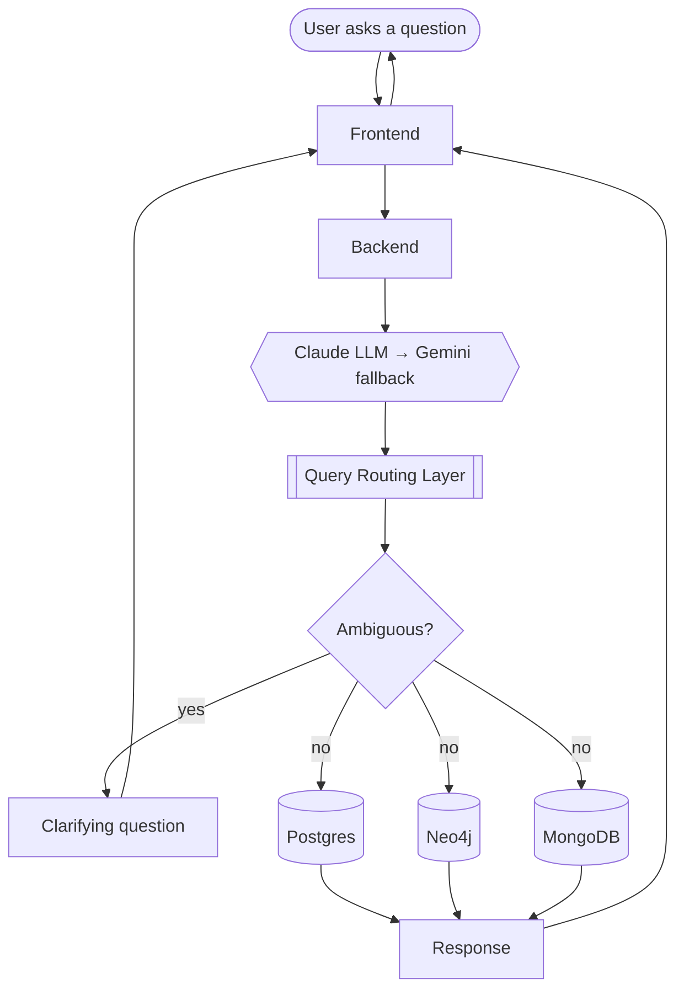
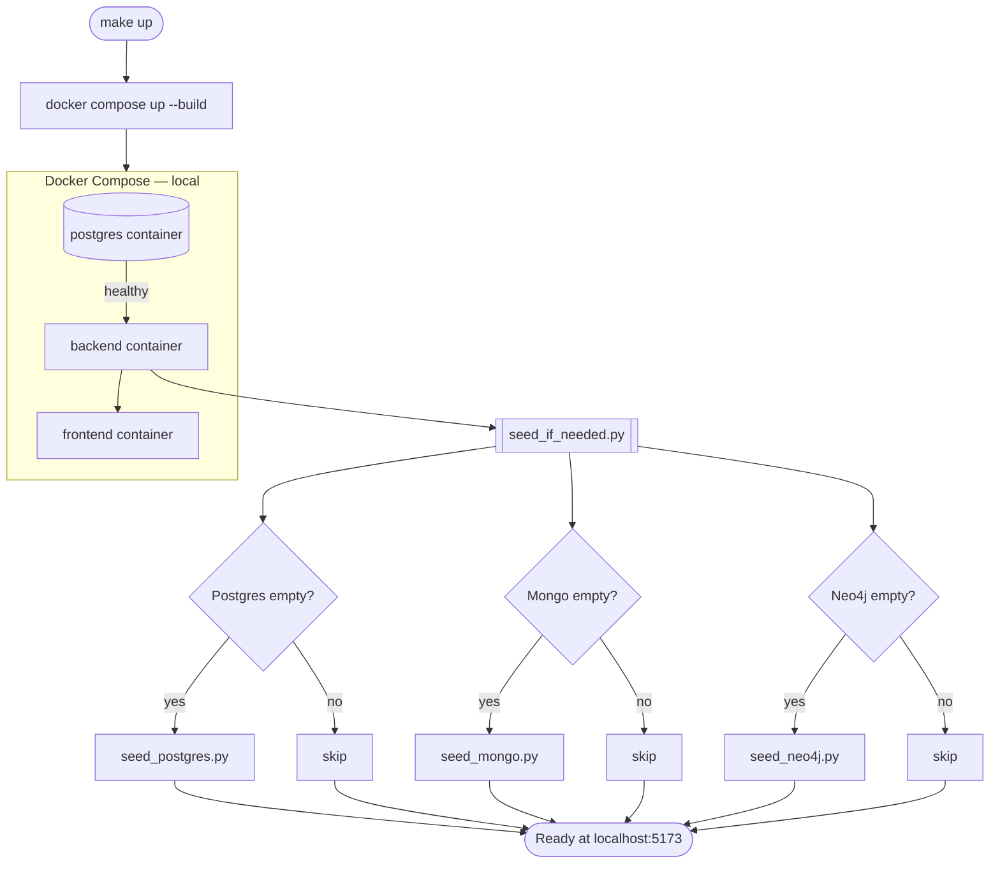

# Multibase — Architecture

One question, automatically routed to the right database. The **Query
Router** is a single LLM call that reads all three database schemas,
picks the one the question needs, and generates the matching query in
the same step — no manual database picker, no separate classification
pass.

## Flow

## Components

| | |
|---|---|
| **Frontend** | React + Vite — renders per response `source`: table/chart, document card, or graph |
| **Backend** | FastAPI — validates and executes the query the router generated |
| **LLM providers** | Claude Sonnet 5 (primary), Gemini 2.5 Flash (fallback on failure) — interprets the question first |
| **Query Routing Layer** | Takes the LLM's interpretation, picks the database *and* writes the query together; if the question is ambiguous, skips the databases entirely and sends a clarifying question straight back to the user |
| **Postgres** | Students, contests, problems, submissions — relational data |
| **MongoDB** | Editorials, problem statements, submission code — nested/flexible content |
| **Neo4j** | Mentorship, follows, rivalries, problem similarity — relationships |

## Docker & seeding flow

`make up` builds and starts everything, then seeds only what's empty —
safe to run on a fresh clone or a machine that already has data.

Only Postgres runs in a local container — Mongo (Atlas) and Neo4j
(AuraDB) are managed cloud services the backend connects to over the
network, so there's nothing local to wait on for those two, just a
live connection check per database inside `seed_if_needed.py`.

See [`DECISIONS.md`](./DECISIONS.md) for the reasoning behind each piece.
